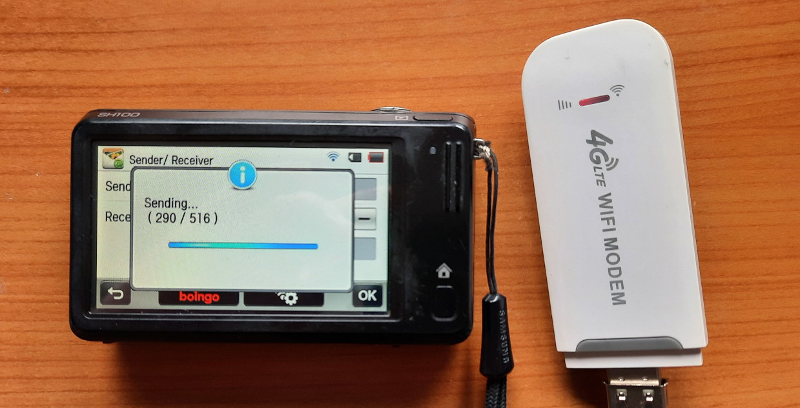

# Flask-based Samsung NX Camera Upload Server

This code is a re-creation of Samsung's Social Network Services (SNS), an API
that allows to send emails and social media posts from WiFi-enabled Samsung
cameras (including Samsung NX, WBxxxF, ...). As the hostnames are hardcoded in
the cameras, DNS redirects are needed to deploy this re-implementation.

You can:

 - send emails
 - post to mastodon
 - store to a directory on the server (and use [inotify](inotify.sh) for further processing)



More information about the project can be found in:

- **Blog post:** [Samsung NX camera to Mastodon bridge](https://op-co.de/blog/posts/samsung_nx_mastodon/)
- **Talk (video and slides):** [Samsung Camera to Mastodon Bridge](https://fosdem.org/2025/schedule/event/fosdem-2025-5026-samsung-camera-to-mastodon-bridge/)

This code is using Flask, but as the Samsung cameras are not fully compliant
with the HTTP standard, we need to apply a minor fix.

For flask 2.x.x, `flask-2.diff` will "fix" the case-insensitive fileName field
for email upload and accept the missing multi-part end boundary.

For flask 3.x.x, `flask-3.diff` will also accept the missing multi-part end
boundary and additionally remove the dot stripping and IDNA conversion on
cookie domains.

## Supported models

The following camera models (generations) support sending e-mails or uploading
files (see
[Samsung WiFi Cameras](https://op-co.de/blog/posts/samsung_wifi_cameras/) for
details on the compacts):

- ST1000: doesn't work, using unknown API
- EX2F, ST200F, DV300F: **working**
- WBxxxF: see [camera table](https://op-co.de/blog/posts/samsung_wifi_cameras/#index2h2)
- NX mini (M7MU): **working**
- NX1000 (DRIMeIII): **unknown**
- NX30, NX300(M), NX310, NX2000 (DRIMeIV): **working on NX300**, should work on the other models
- NX500, NX1 (DRIMeV): **working on NX500**, should work equally on NX1

**NX mini issues**: this used to be unreliable before the NX mini hotspot detection was
[fixed](https://github.com/ge0rg/samsung-nx-emailservice/commit/b475ee7e83ad4434e13f0b9579f09bc0a023cfcc).

## Supported sharing services

Tested on NX300, NX mini and NX500:
- Email
- Facebook
- Picasa

Not supported (services are using an OAuth authentication flow that is not
reverse-engineered yet):
- SkyDrive
- Flickr
- Dropbox

## Configuration

### Email

To send emails, you need to configure an SMTP (smarthost) account in
`config.toml`. All photos sent from the camera's "Send email" function will be
sent accordingly, unless you define a different _action_ for an address.

For email addresses, the supported _actions_ are:

- `email` (default)
- `store`
- `mastodon`
- `shell`

See below for an explanation of the action values.

### Social Media

Photos and videos sent via any of the supported emulated social media services
will be stored under a subdirectory of the `UPLOAD_FOLDER`. A different
_action_ can be defined:

- `store` (default)
- `mastodon`

See below for an explanation of the action values.

### Mastodon

#### Using the login script

After installation, run the login script with the Mastodon server domain as
a parameter:

    source ./venv/bin/activate
    ./mastodonlogin.py https://photog.social

The script will print the Authorization page URL of your Mastodon instance,
which you need to open in the browser. It will ask for a write permission for
posts and media, in order to submit new posts.

After authorizing the app, you will see an "authorization code" that you need
to paste back into the waiting `mastodonlogin` script.

The script will create a file `mastodon.secret` containing the server domain,
the client secret and your user token. Please ensure that `config.toml` contains
a reference to the file in the `[MASTODON]` section as `TOKEN=mastodon.secret`
(the `BASE_URL` can be either omitted, or it must match the domain in the
secret file).

You can create multiple secret files for different instances and use action
instances to post on different accounts.

#### Manual configuration (alternative)

Go to Settings / Developer on your Mastodon instance, and create a new
application. You only need to allow `write:statuses` and `write:media`.

Please call it "samsung-nx-emailservice" and link to this repositroy.

Once created, you can copy "your access token" into the `TOKEN` variable and
the server domain into `BASE_URL` in the `[MASTODON]` config section.

## Mapping services to actions

It is possible to override what happens with uploaded images, based on the
service chosen in the camera or the recipient email address.

Some cameras, like the NX500, only support sending emails. With the mapping
mechanism it is possible to define custom email recipient addresses to
instead post images to Mastodon or store them on the server.

### Actions

The _action_ method is meant to launch different actions based on which social
network or recipient email address you select on the camera.

You can define trigger email addresses like `mastodon@example.com` to make
Mastodon posts from the "send email" menu on cameras that don't support social
networks, like the NX500.

You can also use "facebook" to store files on the servers and "picasa" to call
an external script.

Some _actions_ can also have _instances_, separated by a `"."`. Each instance
corresponds to a dedicated configuration block. The instance configuration
inherits the full default configuration!

For example, `"masto@mydomain.com" = "mastodon"` will
catch emails written to "masto@mydomain.com" and create a Mastodon post using
the default _instance_ configured in `[MASTODON]`, whereas
`"masto-public@mydomain.com" = "mastodon.pub"` will use the Mastodon
_instance_ configured in `[MASTODON.pub]`.

See below for the action values.

#### `email` Action

An email will be sent via the smarthost, using the camera-supplied From
address, To address, Subject, and message body.

Currently, no _instances_ are supported for `email`.

#### `store` Action

All uploaded files will be stored under a subdirectory of the `UPLOAD_FOLDER`.
The subdirectory will be the HMAC-SHA256 hash of the username, protected by
`SECRET` to prevent guessing.

The respective directory can be monitored using inotify to implement further
processing (`inotifywait -q -e close_write -r $UPLOAD_FOLDER`).

If an _instance_ is specified, the instance name will override the destination
folder name under `UPLOAD_FOLDER`.

#### `mastodon` Action

Files uploaded using this action will be converted into a Mastodon post.

You **must** define alt-text for **all** images and videos. For social media,
this is technically required because the camera does not tell in advance how
many files are to be expected. For emails, this is used to help visually
impaired people. Alt-text must follow the body, separated using the tilde
character.

For example, the message body "Holiday shot!\~fancy flower bed\~traffic sign"
must be accompanied by two photos, and will be posted as follows:

> Holiday shot!
> 
> 📷️ *\<camera model if supplied by camera>*
>
> *\<content of config variable MASTODON_POSTSCRIPT>*

Image 1: fancy flower bed

Image 2: traffic sign

An _instance_ specifies a dedicated configuration block that can override
individual options.

#### `shell` Action

It is possible to call external commands as an action. By default, the `store`
action will be executed first, creating the uploaded file(s) on disk.

After that, the command specified as `CMD` will be executed in a *blocking*
fashion, for *each* uploaded file individually.

If the `STDIN` variable is defined, its content will be passed to the command's
standard input.

The config variables can use the following placeholders:
 - `{sender}` - the sender email address (camera config)
 - `{recipient}` - the recipient email address
 - `{filename}` - the absolute path to the uploaded file
 - `{subject}` - the email subject 
 - `{body}` - the email body 

An _instance_ specifies a dedicated configuration block that can override
individual options.

#### Action example

To redirect all photos uploaded to "Facebook" or sent via email to
"example@mastodon.social" to Mastodon, and to only store photos sent to
"store@example.com", you need to define the following three actions:

```toml
[ACTIONS]
facebook = "mastodon"
"example@mastodon.social" = "mastodon"
"store@example.com" = "store"
```

## Installation

1. Change the path, secret and email / mastodon settings in `config.toml`

1. Add your email server credentials to `config.toml`

1. Install the virtual environment, patch flask, and run the (development) server:

```
python3 -m venv venv
source ./venv/bin/activate
pip3 install -r requirements.txt
patch -p1 < flask-3.diff # for flask 3.x.x
sudo python3 samsungserver.py
```

3. Forward incoming traffic on port 80 to the server (running on `*:8080` by
   default)

4. On your camera, add the IP of your server to `/etc/hosts`:

```
192.168.1.23   gld.samsungosp.com www.samsungimaging.com www.ospserver.net snsgw.samsungmobile.com
# For ST200F and WB850F also add this:
192.168.1.23   www.yahoo.co.kr
# For WB35F, WB36F, WB37F, WB1100F also add this:
192.168.1.23   www.msn.com
```

## NX1/NX500

You can directly write to the root filesystem on DRIMeV cameras:

```
mount / -o remount,rw
echo "192.168.0.11 gld.samsungosp.com www.samsungimaging.com www.ospserver.net snsgw.samsungmobile.com" > /etc/hosts
mount / -o remount,ro
```

## NX300/NX30/NX2000

The DRIMeIV cameras have a read-only rootfs that gets reset on restart. You need to put the `hosts` file onto the SD card and copy it to /etc from `autoexec.sh`:

```
mount / -o remount,rw
cp /mnt/mmc/hosts /etc
mount / -o remount,ro
```

## Custom DNS server

You can add the DNS entries to your local / custom DNS server. **It is not
advised to run a public resolver though!**

You can either add the names to the global `/etc/hosts` file or have a custom
file like `/etc/hosts.samsungnx` which you need to inform the DNS server about.

### dnsmasq

Add your custom hosts file to dnsmasq as follows:

`dnsmasq ... -addn-hosts=/etc/hosts.samsungnx`

## No support for other camera models

The firmware for other models must be patched to replace the hostname. So far,
no reverse engineering efforts have been made to understand the logic and to
be able to change individual parts.
